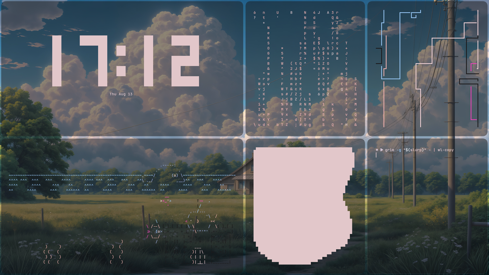

# De Windows a estación de pruebas Arch + Hyprland

Un Huawei MateBook D14 (2019) que llevaba años parado, convertido en un segundo entorno de desarrollo desde cero: particionado manual, Arch Linux instalado a mano, y Hyprland con un rice completo encima.

## Por qué

Estudiante de sociología, en transición hacia desarrollo de software e IA. Este proyecto nació como forma de aprender infraestructura real —particionado, bootloaders, gestión de red, entornos gráficos— sin arriesgar mi máquina principal, y de tener algo tangible que mostrar durante esa transición.

## Hardware

| Componente | Detalle |
|---|---|
| Modelo | Huawei MateBook D14 (2019) |
| CPU | AMD Ryzen 5 3500U |
| RAM | 8GB (2x4GB) |
| Almacenamiento | 512GB NVMe (LITEON) |
| GPU | AMD Radeon Vega 8 (integrada) |

## Stack

- **Base:** Arch Linux, instalación manual (sin `archinstall`), particionado con `cfdisk`
- **Bootloader:** GRUB (UEFI)
- **Compositor:** Hyprland (Wayland)
- **Rice:** [end-4/dots-hyprland](https://github.com/end-4/dots-hyprland) — Quickshell, Waybar, tema Material You
- **Terminal:** kitty + fish
- **Gestor de paquetes AUR:** yay

## Proceso

1. **Particionado manual** con `cfdisk`: EFI (512M, FAT32) + swap (8G) + raíz (resto, ext4)
2. **Instalación base** con `pacstrap`, configuración de `fstab`, `chroot`
3. **Configuración del sistema**: zona horaria, locale (es_ES.UTF-8), hostname, teclado, usuario y sudo
4. **Bootloader**: instalación y configuración de GRUB en modo UEFI
5. **Red**: NetworkManager para gestión de WiFi
6. **Entorno gráfico**: Hyprland + dependencias (pipewire, xdg-desktop-portal-hyprland, sddm)
7. **Rice**: instalación del dotfiles de end-4 vía `yay` y su script de instalación

### Problemas reales que aparecieron (y cómo se resolvieron)

- **Mirrors lentos/mal geolocalizados**: el `pacman` por defecto tiraba de servidores en Australia/Argentina. Solución: `reflector` filtrado por país (España) para regenerar el mirrorlist.
- **DNS roto dentro del chroot**: sin `/etc/resolv.conf`, ningún paquete se podía descargar una vez dentro del sistema instalado.
- **GRUB "instalado" pero sin arrancar**: la partición `/boot` no estaba realmente montada en el momento de ejecutar `grub-install`, así que escribió en el lugar equivocado. Se detectó verificando `efibootmgr -v` y comprobando que la entrada de arranque no existía.
- **WiFi lento** en instalaciones grandes (Hyprland + dependencias): resuelto usando tethering desde el móvil como red alternativa más rápida.

## Próximos pasos

Este repo se irá actualizando con:
- [ ] Servidor local (Flask) para transferencia de archivos/portapapeles entre iPhone y el portátil vía NFC, sustituyendo la función propietaria "Huawei Share"
- [ ] Automatización de transcripción de entrevistas de campo con Whisper local
- [ ] Dotfiles personalizados propios (una vez termine de personalizar el rice)

---

Si te sirve algo de este proceso, siéntete libre de usarlo. Cualquier duda sobre algún paso concreto, abre un issue.
